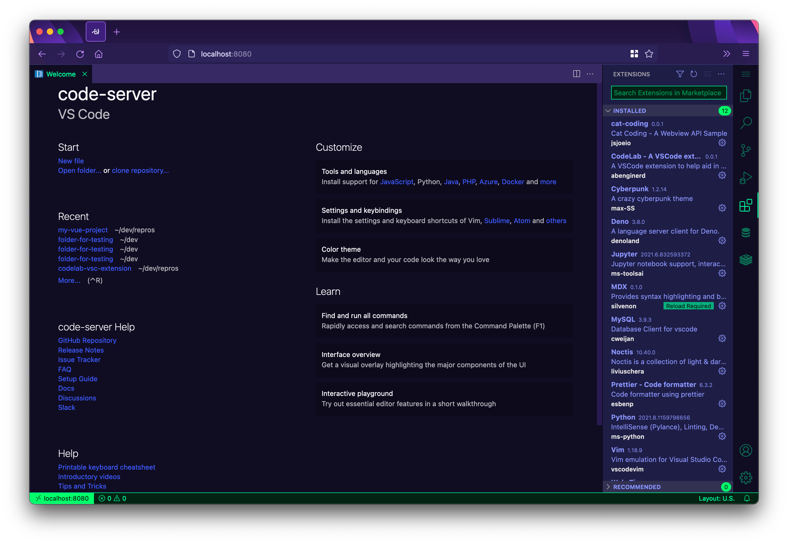

# code-server

[](https://github.com/coder/code-server/discussions) [](https://coder.com/community) [](https://twitter.com/coderhq) [](https://codecov.io/gh/coder/code-server) [](https://coder.com/docs/code-server/latest)

您可以在任何地方、任何机器上运行 [VS Code](https://github.com/Microsoft/vscode)并在浏览器中访问它



## 优点特性

- 在具有一致开发环境的任何设备上编写代码
- 使用云服务器加速测试、编译、下载等
- 在旅途中保持电池寿命；所有密集型任务都在您的服务器上运行

> **Note**
> 要管理多个 IDE、工作区和团队，请参阅我们的新项目: [coder/coder](http://cdr.co/coder-github)

## Requirements

请参阅最低规格要求[requirements](requirements.md)，以及有关如何设置可以安装`code-server`的 Google VM 的说明。

**TL;DR:** ，总结： 2核1G 的 Linux 服务器并支持WebSockets

## 入门

这里提供3种安装方式

1. 使用 [安装脚本](https://github.com/coder/code-server/blob/main/install.sh), 它可以自动执行大部分过程。如果可能，该脚本会使用系统包管理器
2. 手动安装 [code-server](https://coder.com/docs/code-server/latest/install)
3. 使用我们的一键式按钮和指南将代码服务器部署到[云提供商](https://github.com/coder/deploy-code-server) ⚡

如果您使用安装脚本，您可以预览安装过程中发生的情况:

```bash
curl -fsSL https://code-server.dev/install.sh | sh -s -- --dry-run
```

仅安装，请运行

```bash
curl -fsSL https://code-server.dev/install.sh | sh
```

完成后，安装脚本会打印出运行和启动`code-server`的说明

我们还有深入的[设置和配置指南](https://coder.com/docs/code-server/latest/guide)

## 常见问题

[常见问题](https://coder.com/docs/code-server/latest/FAQ).

## 贡献人员

详细信息，请参阅贡献[Contributing](https://coder.com/docs/code-server/latest/CONTRIBUTING)

## 招聘

有兴趣在 [Coder](https://coder.com/careers) 工作吗？查看我们的[空缺职位](https://coder.com/careers#openings)！

## 组织

想要为您的组织或企业进行远程开发？访问我们的网站以了解有关 [Coder](https://coder.com) 的更多信息
